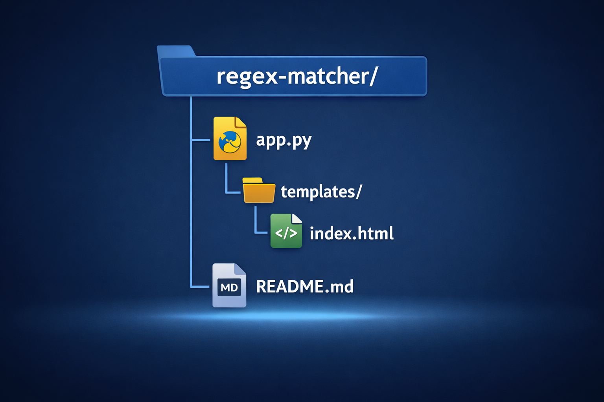

# 🔍 Regex Matching Web Application (Flask)

A lightweight **Flask-based web application** that replicates the **core functionality of regex101.com**.  
This project allows users to input a **test string** and a **regular expression**, then displays **all matching substrings** using Python’s regex engine.

---

## 🎯 Project Objective

The objective of this project is to:
- Understand how **regular expressions** work internally
- Apply regex logic in a **real-world web application**
- Handle **user-driven inputs** safely
- Build a minimal yet functional **developer utility**

---

## ⚙️ Application Workflow

1. User enters a **test string**
2. User provides a **regular expression**
3. On clicking **Submit**, the backend evaluates the regex against the input
4. All matching substrings are extracted and displayed
5. Invalid regex patterns are handled gracefully

---

## 🛠️ Tech Stack

- **Backend:** Flask (Python)
- **Regex Engine:** Python `re` module
- **Frontend:** HTML + Jinja2 Templates
- **Form Handling:** POST requests
- **Error Handling:** `re.error` exception handling

---

## 📁 Project Structure




---

---

## 🚀 Getting Started

### 1️⃣ Clone the Repository
```bash
git clone https://github.com/your-username/regex-matcher.git
cd regex-matcher
```

### 2️⃣ Install Dependencies
```bash
pip install flask
```

### 3️⃣ Run the Application
```bash
python app.py
```

### 4️⃣ Open in Browser
```bash
http://127.0.0.1:5000/
```


## 🧠 Key Learnings

- Practical understanding of regular expression pattern matching

- Backend request–response lifecycle in Flask

- Safe handling of dynamic user inputs

- Translating theory into real-world tooling

- Importance of validation and error handling

## 📌 Assignment Context

This project was developed as part of a hands-on assignment focused on implementing core regex matching functionality.

Special thanks to Innomatics Research Labs for emphasizing implementation-first learning through practical assignments.

## 📜 License

This project is intended for educational and learning purposes.
 
